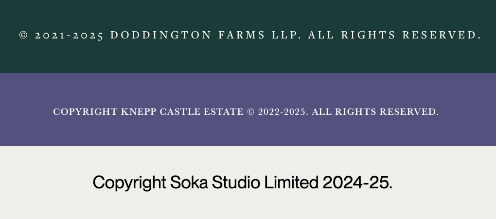

# Current Year Shortcode

Adds a shortcode to display the current year or a year range, perfect for copyright statements.

## Description

This is a plugin which adds a simple shortcode to display the current year or a dynamic year range, particularly useful for copyright statements at the bottom of your website.

Its most basic usage is `[year]`, which will display the current year. If you provide a starting year with the 'from' parameter, it will expand into a date range when the 'from' year is before the current year.

If `[year]` is used by another plugin, then it uses the fallback `[runthings_year]` which can be customised with the `runthings_current_year_shortcode_tag` filter. You can see the active shortcode tag in it entry in the installed plugins page.

### Features

- Display current year with `[year]`
- Create a dynamic year range with `[year from="2020"]`
- Abbreviated year format with `[year from="2020" mode="short"]`, which shows "2020-25" (if the current year is 2025)
- Automatic fallback shortcode `[runthings_year]` if another plugin already uses the 'year' shortcode
- Filter (`runthings_current_year_shortcode_tag`) to set your own shortcode

### Usage Examples

Assuming the current year is 2025:

- `[year]` displays "2025"
- `[year from="2025"]` displays "2025" (since it's the current year)
- `[year from="1983"]` displays "1983-2025"
- `[year from="2020" mode="short"]` displays "2020-25" (shortened current year)
- `[year from="1995" mode="short"]` displays "1995-2025" (not shortened because centuries differ)

## Installation

1. Upload the plugin files to the `/wp-content/plugins/runthings-current-year-shortcode` directory, or install the plugin through the WordPress plugins screen directly.
2. Activate the plugin through the 'Plugins' screen in WordPress.
3. Use the `[year]` shortcode in your posts, pages, or widgets.

## Frequently Asked Questions

### What if another plugin already uses the [year] shortcode?

If another plugin already uses the `[year]` shortcode, this plugin will automatically use `[runthings_year]` instead to avoid conflicts.

### How can I check which shortcode is active?

On the Plugins admin page, you'll see the active shortcode listed in the plugin's row.

### Can I use this in my footer?

Yes! This shortcode works perfectly in footer widgets, custom footer code, or anywhere else shortcodes are supported in your theme.

### What's the 'mode=short' parameter for?

When using a date range with years in the same century (e.g., 2020-2025), the 'short' mode will abbreviate the end year to just the last digits (2020-25), creating a cleaner look for your copyright statements.

## Screenshots

1. Using the shortcode in a footer widget
   

2. Plugin info showing the active shortcode
   

3. Help tab with usage examples
   

## Changelog

### 2.0.0 - 15th March 2025

- Update year examples to 2025
- Added fallback shortcode runthings_year if year is taken
- Added `runthings_current_year_shortcode_tag` filter to customise the shortcode
- Added contextual help tab to plugins page
- Added usage examples link to plugins page
- Added active shortcode info to plugins page
- Prepare for WordPress.org repository

### 1.3.0 - 5th January 2024

- Update year examples to 2024

### 1.2.0 - 29th May 2023

- Update year examples to 2023

### 1.1.0 - 19th February 2022

- Added license
- Updated plugin meta
- Added readme file
- Initial public release

### 1.0.0 - 25th August 2021

- Internal release

## Additional Notes

Built by Matthew Harris of runthings.dev, copyright 2021-2025.

Visit [runthings.dev](https://runthings.dev/) for more WordPress plugins and resources.

Contribute or report issues at [GitHub repository](https://github.com/runthings-dev/runthings-current-year-shortcode).

## License

This program is free software; you can redistribute it and/or modify it under the terms of the GNU General Public License as published by the Free Software Foundation; either version 3 of the License, or (at your option) any later version.

This program is distributed in the hope that it will be useful, but WITHOUT ANY WARRANTY; without even the implied warranty of MERCHANTABILITY or FITNESS FOR A PARTICULAR PURPOSE. See the GNU General Public License for more details.

You should have received a copy of the GNU General Public License along with this program; if not, see [http://www.gnu.org/licenses/gpl-3.0.html](http://www.gnu.org/licenses/gpl-3.0.html).

Icon - Calendar by Qadeer Hussain, from Noun Project, [https://thenounproject.com/browse/icons/term/calendar/](https://thenounproject.com/browse/icons/term/calendar/) (CC BY 3.0)

Icon - legal by hanis tusiyani, from Noun Project, [https://thenounproject.com/browse/icons/term/legal/](https://thenounproject.com/browse/icons/term/legal/) (CC BY 3.0)
